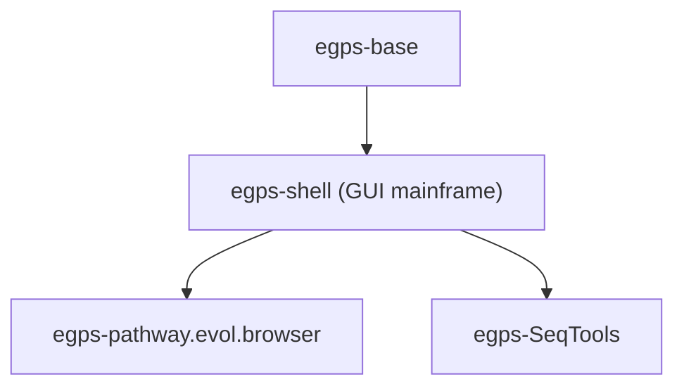
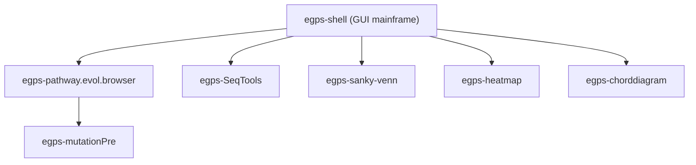

# eGPS 2.1 (eGPS2) — Final Release Collection

This folder is the **final release workspace** for the eGPS2 software platform.

If you are an end user and not familiar with the terminal, you do **not** need to learn the internal modules or use the command line: just download the packaged release, unzip it, and double-click the launcher.

Go to [Releases](https://github.com/yudalang3/eGPS_v2.1/releases) to download.

[中文版 README](README_zh.md)

## What is eGPS2?

**eGPS (The evolutionary Genotype Phenotype System Biology)** is a modular bioinformatics software platform.

This repository area collects the core framework and a set of applications/tools, so we can publish a **single, end-user-friendly** final software package.

## For end users (recommended)

- Download the latest packaged release from the project release page.
- Unzip it to any folder.
- Launch eGPS2 using the provided launcher (double-click).

Notes:
- Some releases bundle Java. If you prefer DIY, download the **no-JRE** variant and configure your preferred JRE yourself.

## What is included here?

Main stream modules (typical dependency order):

- `egps-base`: base utilities and infrastructure
- `egps-shell`: a publish/launcher wrapper; includes the GUI mainframe (**not open source**, but free to use)
- `egps-pathway.evol.browser`: application module (Pathway Evolution Browser)
- `egps-SeqTools`: another application module

Their dependencies are roughly:

Other standalone application modules in this collection (examples):

- `egps-mutationPre`: genomic mutation presenter (depends on egps-pathway.evol.browser)
- `egps-sanky-venn`: Sankey plot and Venn plot (merged module)
- `egps-heatmap`: heatmap plot
- `egps-chorddiagram`: chord diagram

Most of these modules are at the same level as `egps-pathway.evol.browser` / `egps-SeqTools`, except `egps-mutationPre` which depends on `egps-pathway.evol.browser`.

Of course, you can also develop your own projects on top of the upper-level modules (e.g. `egps-pathway.evol.browser`) because the eGPS2 functional modules are open sourced.

## For developers (optional)

If you need the source code of any module, please check the corresponding GitHub repository (the source code is publicly available where applicable).

You can import the projects into IntelliJ IDEA, Eclipse, or VS Code. We use IntelliJ IDEA by default. The `egps-shell` JAR is already included in the no-install release package; please add compile-time dependencies as needed for development.

## Documentation

- Documentation (Yuque): https://www.yuque.com/u21499046/egpsdoc
- Documentation (Yuque): https://www.yuque.com/u21499046/pathway.browser

## License

See `LICENSE` in this directory and the license files inside each module.
