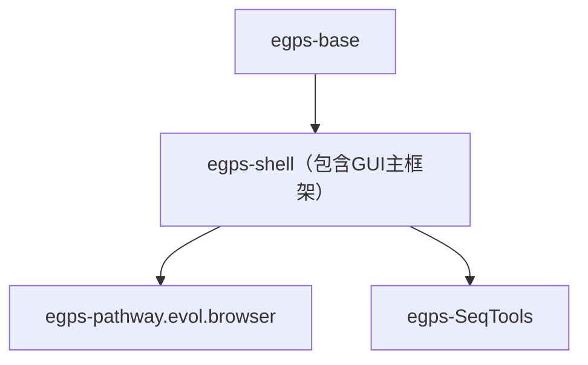
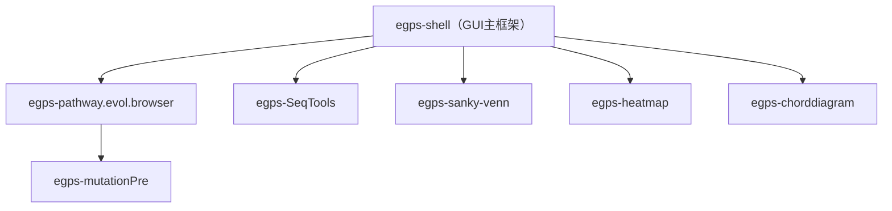

# eGPS 2.1（eGPS2）— 最终发布集合

本目录用于 **eGPS2 平台的最终发布**（Release Collection）。

如果你是终端不熟悉的普通用户，你不需要了解内部模块结构，也不需要使用命令行：只要下载打包好的发布版本，解压后双击启动即可。

Go to [Releases](https://github.com/yudalang3/eGPS_v2.1/releases) to download.

[English README](README.md)

## eGPS2 是什么？

**eGPS（The evolutionary Genotype Phenotype System Biology）** 是一个模块化的生物信息学软件平台。

本仓库/目录将 eGPS2 的核心框架与多个应用/工具模块进行汇总，用于发布一个对非技术用户更友好的 **最终可用软件包**。

## 给终端不熟悉的用户（推荐）

- 从项目的 Release 页面下载最新的打包版本。
- 解压到任意目录。
- 双击发布包内的启动程序启动 eGPS2。

说明：
- 部分发布包会自带 Java；当然如你喜欢DIY，你可以下载noJRE的版本，自己配置自己喜欢的JRE。

## 这里包含哪些内容？

主干模块（典型依赖顺序）：

- `egps-base`：基础工具与核心基础设施
- `egps-shell`：用于发布/启动主框架的壳工程；GUI 主框架（**未开源**，但可免费使用）
- `egps-pathway.evol.browser`：应用模块（Pathway Evolution Browser）
- `egps-SeqTools`：另一个应用模块

他们的依赖关系如下：

本集合中的其他独立应用模块（示例）：

- `egps-mutationPre`：基因组突变展示（依赖于 egps-pathway.evol.browser）
- `egps-sanky-venn`：桑基图与Venn图（合并模块）
- `egps-heatmap`：热图
- `egps-chorddiagram`：弦图

这些模块大部分和`egps-pathway.evol.browser`/`egps-SeqTools` 平级，但 `egps-mutationPre` 依赖于 `egps-pathway.evol.browser`。

当然您也可以在 `egps-pathway.evol.browser` 这些上层的模块基础上进行项目开发，因为eGPS2的所有功能模块都是开源的。

## 给开发者（可选）

需要什么项目可以直接去相应的GitHub repo. 查看即可，源码均开放。

你可以直接导入IDEA，Eclipse以及VS Code，我们默认用IDEA开发，`egps-shell`对应的jar文件，我们已经在免安装版本里面提供，请自行添加编译时期的依赖。

## 文档

一些具体的问题，可以在各个Git repo中查看，我们也写了一些教程：

- 在线文档（语雀）：https://www.yuque.com/u21499046/egpsdoc
- 在线文档（语雀）：https://www.yuque.com/u21499046/pathway.browser

## 许可证

请查看本目录的 `LICENSE`，以及各模块目录中的许可说明。
